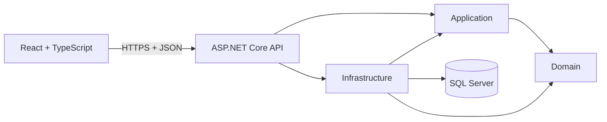

# PersonalOS

PersonalOS es una plataforma personal para planificar, ejecutar, registrar y revisar el día a día. Integra agenda, tareas, hábitos, nutrición, diario y análisis semanal.

También funciona como caso de estudio profesional para demostrar React, ASP.NET Core, arquitectura, seguridad, pruebas, CI/CD y documentación técnica.

## Visión

```text
Capturar -> Planificar -> Ejecutar -> Registrar -> Revisar -> Ajustar
```

El objetivo no es crear otra lista de tareas. PersonalOS debe ayudar a responder:

- ¿Qué debo hacer ahora?
- ¿Qué estoy descuidando?
- ¿Por qué estoy fallando?
- ¿Qué ajuste concreto debo probar?
- ¿Estoy mejorando de forma sostenible?

## Stack

### Backend

- .NET 10
- ASP.NET Core Web API
- ASP.NET Core Identity
- Entity Framework Core
- SQL Server
- xUnit

### Frontend

- React
- TypeScript
- Vite
- React Router
- TanStack Query
- React Hook Form
- Zod
- Vitest
- React Testing Library

### Ingeniería

- monolito modular;
- REST y OpenAPI;
- cookie authentication;
- antiforgery;
- GitHub Actions;
- auditoría de dependencias;
- pruebas automatizadas.

## Arquitectura



Dirección permitida:

```text
Application -> Domain
Infrastructure -> Application + Domain
Api -> Application + Infrastructure
Domain -> ninguna capa externa
```

## Estructura

```text
PersonalOS/
├── src/
│   ├── PersonalOS.Domain/
│   ├── PersonalOS.Application/
│   ├── PersonalOS.Infrastructure/
│   └── PersonalOS.Api/
├── web/
│   └── PersonalOS.Web/
├── tests/
│   ├── PersonalOS.UnitTests/
│   └── PersonalOS.IntegrationTests/
├── docs/
│   ├── 01_PRODUCT.md
│   ├── 02_ARCHITECTURE.md
│   └── 03_DELIVERY.md
├── AGENTS.md
├── README.md
├── global.json
└── PersonalOS.slnx
```

## Documentación

1. [`docs/01_PRODUCT.md`](docs/01_PRODUCT.md): visión, alcance, experiencia, módulos y roadmap.
2. [`docs/02_ARCHITECTURE.md`](docs/02_ARCHITECTURE.md): arquitectura, seguridad, datos, MVC → React y evolución a SaaS.
3. [`docs/03_DELIVERY.md`](docs/03_DELIVERY.md): Milestone 1, API, pruebas, CI, Definition of Done y operación.
4. [`AGENTS.md`](AGENTS.md): reglas para Claude, Codex y otros agentes.

## Estado actual

- [x] Scaffold por capas.
- [x] React independiente.
- [x] Referencias entre proyectos.
- [x] Build de .NET.
- [x] Build de React.
- [x] Auditoría inicial de dependencias.
- [x] Documentación consolidada.
- [ ] M1: autenticación y walking skeleton implementado y validado localmente;
  pendiente de ejecución remota de CI tras push o pull request.
- [ ] M2: perfil y tiempo.
- [ ] M3: planificación.
- [ ] M4: hábitos.
- [ ] M5: nutrición.
- [ ] M6: diario.
- [ ] M7: revisión semanal.
- [ ] M8: PWA y recordatorios.
- [ ] M9: hardening y producción.

## Validación actual

Backend:

```powershell
dotnet restore .\PersonalOS.slnx
dotnet build .\PersonalOS.slnx --no-restore
dotnet test .\PersonalOS.slnx --no-build
dotnet package list --project .\PersonalOS.slnx --vulnerable --include-transitive
```

Frontend:

```powershell
npm --prefix .\web\PersonalOS.Web ci
npm --prefix .\web\PersonalOS.Web run lint
npm --prefix .\web\PersonalOS.Web run test -- --run
npm --prefix .\web\PersonalOS.Web run build
npm --prefix .\web\PersonalOS.Web audit --audit-level=high
```

## Ejecución local M1

Aplicar la migración inicial en LocalDB Development:

```powershell
dotnet tool restore
$env:ASPNETCORE_ENVIRONMENT='Development'
dotnet tool run dotnet-ef database update --project .\src\PersonalOS.Infrastructure\PersonalOS.Infrastructure.csproj --startup-project .\src\PersonalOS.Api\PersonalOS.Api.csproj
```

Iniciar API y React:

```powershell
dotnet run --project .\src\PersonalOS.Api\PersonalOS.Api.csproj --launch-profile https
npm --prefix .\web\PersonalOS.Web run dev
```

Vite proxya `/api` y `/health` hacia `https://localhost:7268`.

## Evolución futura

PersonalOS inicia como producto personal. No se agrega multi-tenancy anticipadamente.

Ownership inicial:

```text
AppUser -> recursos mediante UserId
```

Posible evolución:

```text
AppUser -> WorkspaceMembership -> Workspace -> Resources
```

La evolución requerirá análisis de autorización, aislamiento, migración y seguridad.

## Objetivo profesional

Este repositorio debe demostrar que el desarrollador puede:

- definir un producto;
- diseñar límites arquitectónicos;
- construir frontend y backend;
- proteger datos;
- probar comportamiento;
- operar software;
- documentar decisiones;
- justificar qué construir y qué no construir todavía.

## Autor

Jefferson Rojas  
Costa Rica  
Ingeniería en Sistemas  
Enfoque: .NET, React, SaaS y arquitectura de software.
