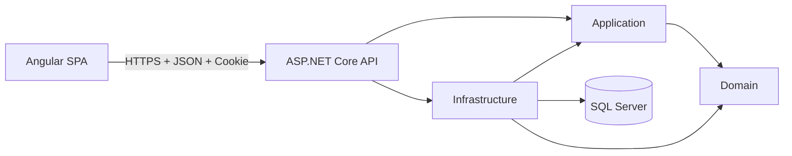

# PersonalOS

PersonalOS is a personal platform for planning, executing, recording, and reviewing daily life. It brings together scheduling, tasks, habits, nutrition, journaling, and weekly analysis.

It also serves as a professional case study demonstrating Angular, ASP.NET Core, software architecture, application security, automated testing, CI/CD, and technical documentation.

## Vision

```text
Capture -> Plan -> Execute -> Record -> Review -> Adjust
```

The goal is not to create another task list. PersonalOS should help answer:

- What should I do now?
- What am I neglecting?
- Why am I falling behind?
- What concrete adjustment should I try?
- Am I improving sustainably?

## Technology stack

### Backend

- .NET 10
- ASP.NET Core Web API
- ASP.NET Core Identity
- Entity Framework Core
- SQL Server
- xUnit

### Frontend

- Angular
- TypeScript
- SCSS
- Angular Router
- Angular HttpClient
- Signals
- Typed reactive forms
- The test runner configured by the installed Angular CLI version

### Engineering

- modular monolith;
- REST and OpenAPI;
- same-origin cookie authentication;
- antiforgery protection;
- server-side authorization;
- structured Problem Details;
- rate limiting;
- secure browser-state rules;
- dependency auditing;
- automated tests;
- GitHub Actions;
- living technical documentation.

## Architecture



Allowed dependency direction:

```text
Application -> Domain
Infrastructure -> Application + Domain
Api -> Application + Infrastructure
Domain -> no external layer
Angular -> API only
```

The Angular application never accesses SQL Server directly. Route guards improve navigation and user experience, but every protected API operation must enforce authorization on the server.

## Repository structure

```text
PersonalOS/
+-- src/
|   +-- PersonalOS.Domain/
|   +-- PersonalOS.Application/
|   +-- PersonalOS.Infrastructure/
|   +-- PersonalOS.Api/
+-- web/
|   +-- PersonalOS.Web/
+-- tests/
|   +-- PersonalOS.UnitTests/
|   +-- PersonalOS.IntegrationTests/
+-- docs/
|   +-- 01_PRODUCT.md
|   +-- 02_ARCHITECTURE.md
|   +-- 03_DELIVERY.md
+-- AGENTS.md
+-- README.md
+-- global.json
+-- PersonalOS.slnx
```

Angular application structure:

```text
web/PersonalOS.Web/src/app/
+-- core/
|   +-- auth/
|   +-- appearance/
|   +-- errors/
|   +-- forms/
|   +-- http/
|   +-- journal/
|   +-- layout/
|   +-- navigation/
|   +-- nutrition/
|   +-- calendar/
|   +-- profile/
|   +-- routines/
|   +-- study/
|   +-- time/
|   +-- today/
+-- shared/
|   +-- components/
+-- features/
|   +-- authentication/
|   |   +-- login/
|   |   +-- register/
|   +-- today/
|   +-- calendar/
|   +-- routines/
|   +-- nutrition/
|   +-- study/
|   +-- journal/
|   +-- settings/
+-- app.config.ts
+-- app.routes.ts
+-- app.ts
```

The Angular implementation uses Angular framework packages at 22.1.0, Angular CLI 22.1.3,
standalone components, lazy-loaded feature routes, Vitest through the Angular CLI unit-test
builder, and a development proxy for relative `/api` and `/health` calls.

## Documentation

1. [`docs/01_PRODUCT.md`](docs/01_PRODUCT.md): product vision, scope, experience, modules, and roadmap.
2. [`docs/02_ARCHITECTURE.md`](docs/02_ARCHITECTURE.md): architecture, Angular concepts, data, security, and future SaaS evolution.
3. [`docs/03_DELIVERY.md`](docs/03_DELIVERY.md): Milestone 1, API contracts, tests, CI, Definition of Done, and operations.
4. [`AGENTS.md`](AGENTS.md): mandatory rules for Codex, Claude, and other coding agents.

## Current status

- [x] Layered .NET solution scaffold.
- [x] Project references and dependency direction.
- [x] ASP.NET Core Identity and persistence baseline available for audit.
- [x] Angular project scaffold created.
- [x] Previous frontend implementation removed before the Angular migration.
- [x] Product, architecture, delivery, and agent documentation migrated to English and Angular.
- [x] M1: secure Angular authentication walking skeleton implemented locally.
- [x] M1: full local validation gate completed after final review.
- [ ] M1: remote CI validated after push or pull request.
- [x] M2: profile preferences, persisted IANA time zone, `IClock`, and English local date implemented locally.
- [x] M2: full local validation gate completed, including the SQL Server migration upgrade.
- [ ] M2: remote CI validated after push or pull request.
- [x] M3: daily operating system implemented locally: calendar, routines and workouts,
      nutrition, study, journal, and the integrated Today screen.
- [x] M3: full local validation gate completed, including the SQL Server migration and a live
      end-to-end smoke test against LocalDB.
- [ ] M3: remote CI validated after push or pull request.
- [x] Post-M3: Light, Dark, and System appearance preference implemented locally with pre-render
      theme application.
- [ ] M4: weekly review.
- [ ] M5: trends and export.
- [ ] M6: refinement.
- [ ] M7: PWA and reminders.
- [ ] M8: security hardening and production readiness.

A checked item describes repository preparation or an already established baseline. Feature completion must never be claimed without executing the documented validation commands.

## Security baseline

PersonalOS will eventually store sensitive and highly sensitive personal data. Security is therefore part of the architecture from the first milestone.

Core rules:

- authentication uses an ASP.NET Core Identity cookie;
- the authentication cookie is `HttpOnly`;
- production cookies are `Secure`;
- state-changing requests require antiforgery validation;
- authentication tokens are never stored in `localStorage` or `sessionStorage`;
- the current user is loaded from `/api/auth/me` and kept in memory only;
- Angular route guards are not authorization boundaries;
- user ownership is validated by the API;
- permissive CORS is forbidden;
- Angular environment files never contain secrets;
- the appearance preference is the only browser-persisted client preference, contains no personal
  content, and is applied before Angular renders;
- backend strings are rendered as text, not trusted HTML;
- profile ownership is derived from the authentication cookie, never from request data;
- passwords, cookies, tokens, connection strings, and sensitive content must not be logged;
- High and Critical dependency vulnerabilities block delivery unless explicitly reviewed and documented.

See [`docs/02_ARCHITECTURE.md`](docs/02_ARCHITECTURE.md) for the complete security model.

## Validation

### Backend

```powershell
dotnet restore .\PersonalOS.slnx
dotnet build .\PersonalOS.slnx --no-restore
dotnet test .\PersonalOS.slnx --no-build
dotnet package list --project .\PersonalOS.slnx --vulnerable --include-transitive
```

### Frontend

Use the scripts defined in `web/PersonalOS.Web/package.json`. The intended validation gate is:

```powershell
npm --prefix .\web\PersonalOS.Web ci
npm --prefix .\web\PersonalOS.Web run lint
npm --prefix .\web\PersonalOS.Web run test -- --watch=false
npm --prefix .\web\PersonalOS.Web run build
npm --prefix .\web\PersonalOS.Web audit --audit-level=high
```

If the installed Angular test runner uses a different non-watch argument, use its supported equivalent and update this documentation.

Quality gate:

- zero compilation errors;
- zero failed tests;
- zero known High or Critical dependency vulnerabilities, unless a documented exception is approved;
- no committed secrets;
- no hard-coded development API URLs in the production bundle;
- documentation updated;
- reviewed diff.

## Profile and time (Milestone 2)

PersonalOS stores every instant in UTC and converts it for display using the IANA time zone saved
on the account.

| Method | Route | Authentication | Antiforgery |
|---|---|---:|---:|
| GET | `/api/profile` | Yes | No |
| PUT | `/api/profile` | Yes | Yes |
| GET | `/api/time/context` | Yes | No |

Rules:

- `UserPreferences` holds one time zone per account, keyed by `UserId`;
- new accounts and upgraded Milestone 1 accounts default to `UTC`;
- the display name stays on `AppUser`;
- the email address is read-only until confirmation and recovery flows exist;
- application code reads the current instant from `IClock`, never from `DateTime.Now`;
- the server validates every submitted time-zone identifier and rejects Windows-only identifiers;
- the browser time zone is offered as a suggestion and is saved only by explicit user action;
- Angular renders the server-provided `localDate` with an explicit `en-US` locale;
- no profile or time response is written to `localStorage`, `sessionStorage`, or IndexedDB.

Apply the Milestone 2 migration:

```powershell
dotnet tool restore
$env:ASPNETCORE_ENVIRONMENT='Development'
dotnet tool run dotnet-ef database update `
  --project .\src\PersonalOS.Infrastructure\PersonalOS.Infrastructure.csproj `
  --startup-project .\src\PersonalOS.Api\PersonalOS.Api.csproj
```

Review the generated SQL before applying it to any database that matters:

```powershell
dotnet tool run dotnet-ef migrations script InitialIdentity AddUserPreferences `
  --project .\src\PersonalOS.Infrastructure\PersonalOS.Infrastructure.csproj `
  --startup-project .\src\PersonalOS.Api\PersonalOS.Api.csproj
```

## Daily operating system (Milestone 3)

PersonalOS plans a day, records what happened across training, food, and study, and closes it with
a reflection. Everything is scoped to one local calendar day, decided by the server from the
account's saved time zone.

| Method | Route | Antiforgery |
|---|---|---:|
| GET | `/api/today?date=` | No |
| GET | `/api/calendar/month?year=&month=`, `/api/calendar/day?date=`, `/api/calendar/upcoming?from=` | No |
| GET, POST, PUT, DELETE | `/api/calendar/items`, `/api/calendar/items/{id}` | Yes for writes |
| PUT | `/api/calendar/items/{id}/occurrences/{date}/status` | Yes |
| GET, POST, PUT, DELETE | `/api/routines`, `/api/routines/occurrences`, `/api/routines/{id}`, `/api/routines/{id}/sessions` | Yes for writes |
| GET, PUT | `/api/routine-sessions/{sessionId}` | Yes for writes |
| GET, PUT | `/api/nutrition/day`, `/api/nutrition/goal` | Yes for writes |
| POST, PUT, DELETE | `/api/meals`, `/api/meals/{id}` | Yes |
| GET, POST, PUT, DELETE | `/api/study/projects`, `/api/study/sessions` | Yes for writes |
| GET, PUT | `/api/journal/{date}` | Yes for writes |

Design decisions worth knowing before reading the code:

- **Recurrence is calculated, never generated.** A routine stores one rule; occurrences are
  computed for the window a screen asks for. The only row a recurrence writes is a routine session,
  and only when the user actually starts the routine.
- **A repeating calendar activity is a routine.** That gives PersonalOS one recurrence engine
  instead of two, and a repeating activity gains per-day completion for free.
- **Workout history has no foreign key to the routine step.** Editing a routine next month must not
  rewrite the weight that was lifted last week.
- **Today is one aggregate endpoint** composed from the feature services, so the page never renders
  half a day and the summary counters cannot drift from the lists beneath them.
- **Nutrition reports arithmetic only.** No target is proposed, no value is judged, and going over
  the target shows a negative remainder as a plain fact. PersonalOS is not a medical product.
- **Study material is metadata.** A link must be `http` or `https`, the server never fetches it, and
  no file is uploaded.
- **The journal is the strictest case.** Responses are `no-store`, the text is never logged, never
  written to browser storage, never placed in a URL, and never rendered as HTML.

Apply the Milestone 3 migration:

```powershell
$env:ASPNETCORE_ENVIRONMENT='Development'
dotnet ef database update `
  --project .\src\PersonalOS.Infrastructure\PersonalOS.Infrastructure.csproj `
  --startup-project .\src\PersonalOS.Api\PersonalOS.Api.csproj
```

`AddDailyOperatingSystem` is purely additive: eleven new tables, twelve indexes, and no change to
any Identity table or to `UserPreferences`.

## Local Milestone 1 execution

Restore local tools and apply the existing Development migration:

```powershell
dotnet tool restore
$env:ASPNETCORE_ENVIRONMENT='Development'
dotnet tool run dotnet-ef database update `
  --project .\src\PersonalOS.Infrastructure\PersonalOS.Infrastructure.csproj `
  --startup-project .\src\PersonalOS.Api\PersonalOS.Api.csproj
```

Start the API:

```powershell
dotnet run `
  --project .\src\PersonalOS.Api\PersonalOS.Api.csproj `
  --launch-profile https
```

Start Angular in a second terminal:

```powershell
npm --prefix .\web\PersonalOS.Web start
```

The Angular development proxy must forward relative `/api` and `/health` requests to the HTTPS address defined by the API launch profile. Do not hard-code that address in TypeScript.

## Future evolution

PersonalOS begins as a personal product. Multi-tenancy is not introduced prematurely.

Initial ownership:

```text
AppUser -> resources through UserId
```

Possible future evolution:

```text
AppUser -> WorkspaceMembership -> Workspace -> Resources
```

That evolution would require an explicit review of authorization, isolation, migration, invitations, roles, billing, caching, storage, backups, and tenant-aware jobs.

## Professional objective

This repository should demonstrate that the developer can:

- define a product;
- design architectural boundaries;
- build an Angular frontend and an ASP.NET Core backend;
- protect sensitive data;
- reason about XSS, CSRF, cookies, CORS, and browser storage;
- implement server-side authorization;
- test behavior and negative security cases;
- operate and monitor software;
- document decisions;
- explain why a technology was selected;
- justify what should not be built yet.

## Author

Jefferson Rojas
Costa Rica
Systems Engineering
Focus: .NET, Angular, SaaS, application security, and software architecture.
