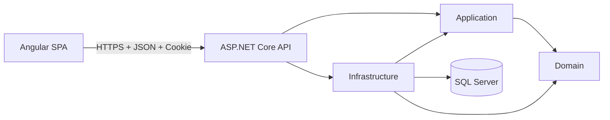
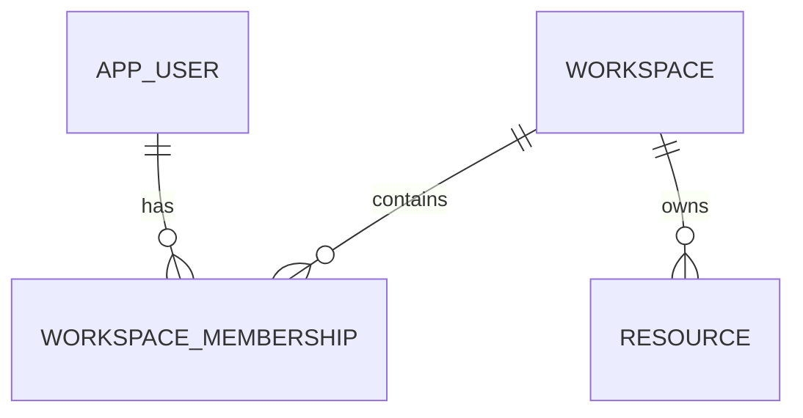

# PersonalOS - Architecture, Security, and Data

**Version:** 1.2
**Status:** Milestone 2 profile and time

## 1. Drivers

- learn Angular without abandoning .NET;
- deliver personal value early;
- protect sensitive data;
- keep operating cost low;
- support automated testing;
- avoid overengineering;
- preserve a possible path toward SaaS;
- create an architecture that can be explained and defended during interviews.

## 2. Architectural style

PersonalOS is a modular monolith with a separate Angular single-page application.



The frontend and backend are separate projects, but they form one product and one security boundary. A same-origin deployment is preferred.

The system does not introduce microservices, multi-tenancy, billing, or a generic repository during the initial milestones.

## 3. Layers

### Domain

Contains:

- entities;
- value objects;
- invariants;
- pure business rules.

Domain does not know about EF Core, SQL Server, ASP.NET Core, Identity, Angular, TypeScript, or HTTP.

### Application

Contains:

- use cases;
- contracts;
- policies;
- internal DTOs;
- abstractions such as clock and current user;
- application-level authorization decisions when they are independent of transport.

Application depends only on Domain.

### Infrastructure

Contains:

- EF Core;
- SQL Server;
- ASP.NET Core Identity persistence;
- external services;
- background workers;
- storage implementations.

Infrastructure depends on Application and Domain.

### API

Contains:

- HTTP endpoints;
- authentication;
- authorization;
- antiforgery;
- Problem Details;
- rate limiting;
- OpenAPI;
- health checks;
- security headers;
- composition root.

API depends on Application and Infrastructure.

The API never exposes EF Core entities or Identity entities directly as public contracts.

### Angular

Contains:

- pages and feature components;
- templates;
- routing;
- authentication state;
- typed reactive forms;
- HTTP communication;
- loading, empty, success, and error states;
- accessibility behavior;
- application shell and responsive navigation.

Angular communicates only with the API. It never accesses SQL Server and never receives password hashes, security stamps, cookies, connection strings, or server secrets.

## 4. MVC to Angular mapping

| Familiar MVC concept | PersonalOS Angular equivalent |
|---|---|
| Razor View | Angular component template |
| Partial View | Reusable standalone component |
| `_Layout.cshtml` | Application shell with `router-outlet` |
| ViewModel | Explicit API DTO plus TypeScript interface or type |
| Controller returning View | API endpoint returning JSON |
| ModelState | Server validation plus typed reactive-form validation |
| Form POST | HttpClient command request |
| TempData | Navigation state or in-memory notification state |
| Session lookup | Authentication cookie plus `/api/auth/me` |
| Antiforgery form token | XSRF request token plus header |
| `RedirectToAction` | Angular Router navigation |
| EF entity rendered in a view | Purpose-built response DTO |
| Dependency injection | Angular `inject()` and ASP.NET Core DI |
| Action filter | API filter, middleware, or endpoint policy |
| Authorization attribute | Server authorization policy; guard only improves UX |

## 5. Angular concepts and boundaries

### Standalone components

The Angular application uses standalone components and does not introduce NgModules for new code.

A component should own:

- one clear user-facing responsibility;
- its template;
- its styles;
- local interaction state.

Large components must be split by responsibility rather than by arbitrary line count.

### Templates

Templates must:

- use semantic HTML;
- use Angular interpolation for text;
- avoid business logic;
- avoid unsafe HTML rendering;
- use the control-flow syntax supported by the installed Angular version;
- expose loading and error states clearly.

Backend-provided strings are treated as plain text.

### Signals

Signals are appropriate for:

- local UI state;
- authentication status;
- current user held in memory;
- derived view state.

Computed signals are used for derived values. Effects are reserved for synchronization with external systems and must not become a default replacement for explicit flow.

### RxJS

RxJS remains appropriate for:

- HttpClient requests;
- cancellation and composition of asynchronous operations;
- router events;
- streams that naturally produce multiple values.

The project does not convert every observable into a signal without a reason.

### Services and dependency injection

Services isolate responsibilities such as:

- authentication operations;
- current authentication state;
- Problem Details parsing;
- cross-cutting HTTP behavior.

Services must not become global bags of unrelated behavior.

### HttpClient

Angular uses `HttpClient` with strongly typed contracts.

Rules:

- use relative `/api` URLs;
- do not hard-code Development ports in TypeScript;
- do not create a generic wrapper that hides all HttpClient behavior;
- never retry login, registration, logout, or other non-idempotent requests blindly;
- expected `/api/auth/me` 401 responses represent anonymous state, not a global application error.

### Route guards

Functional guards:

- prevent unnecessary navigation;
- avoid showing protected pages to anonymous users;
- redirect authenticated users away from login and registration.

Guards are not security boundaries. The API must authorize every protected endpoint.

### HTTP interceptors

Functional interceptors are limited to cross-cutting concerns such as:

- consistent error normalization;
- correlation metadata when approved;
- authentication-loss handling;
- XSRF behavior when Angular's built-in support is not sufficient.

Feature-specific error messages remain inside their feature.

### Typed reactive forms

Login and registration use typed reactive forms.

Client validation improves user experience. Server validation remains authoritative.

Forms must:

- prevent duplicate submissions;
- preserve accessibility associations;
- never log values;
- use generic authentication errors;
- map safe validation errors to controls;
- keep unknown errors in a form-level summary.

### Server state

The current authenticated user is server state.

Startup flow:

```text
Angular starts
-> authentication state is unknown/loading
-> GET /api/auth/me
-> 200: authenticated in-memory state
-> 401: anonymous state
```

The application does not persist the current user or an authentication token in browser storage.

### Appearance preference

The appearance preference is client state, not account state.

```text
index.html pre-render script
-> read personalos.themePreference, when present
-> resolve System with prefers-color-scheme
-> set data-theme and color-scheme before Angular paints
-> ThemeService keeps the document synchronized after startup
```

Rules:

- supported values are `system`, `light`, and `dark`;
- an absent or invalid stored value becomes `system`;
- System listens for operating-system theme changes while the page is open;
- only the non-sensitive preference value is stored in `localStorage`;
- no profile data, current-user object, token, cookie, journal text, meal history, or daily record is
  stored with it;
- the API is not called and no antiforgery token is needed because no server state changes.

## 6. Data

Conventions:

- `Guid` for keys;
- `UserId` for initial ownership;
- `DateTimeOffset` in UTC for instants;
- `DateOnly` for a local calendar day;
- IANA time-zone identifiers;
- unique constraints for invariants;
- indexes based on real query patterns;
- versioned historical goals;
- explicit concurrency decisions for mutable data.

Do not use `DateTime.Now` directly in business rules that must be tested.

Client-provided identifiers never prove ownership. Protected queries derive the authenticated user from the server principal and scope data by that user.

### User preferences

```text
UserPreferences
- UserId               : Guid, primary key, foreign key to AspNetUsers, cascade delete
- TimeZoneId           : string, required, max length 100
- CalendarDayStartTime : TimeOnly, first hour the day planner shows
- CalendarDayEndTime   : TimeOnly, last hour the day planner shows
- CalendarSlotMinutes  : int, 15, 30, or 60
- CreatedAtUtc         : DateTimeOffset, UTC
- UpdatedAtUtc         : DateTimeOffset, UTC
```

Decisions:

- `UserId` is the primary key, so the database enforces one preferences record per account;
- the entity lives in Domain and knows nothing about ASP.NET Core Identity;
- the relationship to `AppUser` is configured in Infrastructure;
- `DisplayName` stays on `AppUser` and is not duplicated here;
- email is never copied into this table;
- new accounts receive the record during registration;
- the `AddUserPreferences` migration backfills existing accounts with `UTC`;
- a read never creates a record: a missing row reports the default instead;
- the calendar's visible hours live here rather than on a calendar item, because they describe how
  this account wants its days drawn and have nothing to do with any particular activity. They are a
  display choice only: an activity outside the window still exists, still counts, and the planner
  offers it in its own section rather than hiding it;
- the timeline settings have their own endpoint, so changing an interval cannot overwrite the
  display name or the time zone that belong to the settings screen;
- the `AddCalendarDisplayPreferences` migration defaults existing accounts to 06:00, 22:00, and 15
  minutes. The scaffolded CLR zeroes would have produced a window with no hours in it;
- no field is added before a milestone needs it.

`UTC` is the default because PersonalOS must be correct for any user. A regional default such as
`America/Costa_Rica` would silently give every other account the wrong calendar day.

### Daily operating system (Milestone 3)

```text
PlanningItem          one calendar item and its recurrence rule; the only calendar aggregate
PlanningItemOccurrenceState  what the user decided about one occurrence on one local day
RoutineTemplate       a repeating sequence; owns RoutineStep and carries the recurrence rule
RoutineStep           the target for one step, renumbered by the aggregate on every save
RoutineSession        one execution of a routine on one local day
RoutineStepResult     what actually happened for one step during one session
NutritionGoal         one calorie and macronutrient target per account
MealEntry             one thing eaten on one local day
StudyProject          a subject, owning StudyResource
StudyResource         title, type, and an optional http or https link; metadata only
StudySession          one recorded block of studying on one local day
DailyJournalEntry     one reflection per account per local day
```

Decisions:

- a calendar item carries its own recurrence rule, so a repeating activity is one row whatever its
  horizon. `RoutineTemplate` keeps a separate rule because it answers a different question: which
  ordered steps to perform and what was actually lifted. The two never share a row;
- `PlanningItemKind` is a label, not a subtype. Task, routine, event, and appointment carry the same
  fields and obey the same rules, so four classes would express four words on a chip and nothing
  else. Kind colours a block; category never does, because there are seven categories and four
  kinds, and "is this a commitment or a task I can move" is what a week is read for;
- an occurrence records one of four outcomes: planned, completed, failed, or cancelled. Failed and
  cancelled are deliberately distinct, because not doing something you meant to do and calling it
  off in advance are different facts about a day. Failed may only be recorded for a day that has
  already arrived in the account's own time zone, and nothing marks itself failed;
- `OccurrenceStatus` values are stored as integers with no check constraint, so a new outcome is
  appended and needs no migration. Existing numbers are never reordered or reinterpreted;
- a `PlanningItemOccurrenceState` row is written only when the user completes, reopens, or cancels a
  specific day. The absence of a row means planned, which is what every day already is;
- once a day has been acted on, an item's repetition and start date are frozen. Moving them would
  silently reattach a completion to a date the user never saw. Ending or shortening a series stays
  allowed, because that only removes days nobody has reached;
- `RoutineStepResult.RoutineStepId` deliberately has no foreign key: removing an exercise from a
  routine next month must not erase the weight that was lifted last week;
- every table has exactly one cascade parent. `RoutineSession` and `StudySession` hang off their
  routine and project rather than off `AspNetUsers`, because two cascade paths into the same table
  are rejected by SQL Server. Ownership is still enforced by filtering every query on `UserId`,
  and deleting an account still removes these rows through their parent;
- `MealEntry.Quantity` is free text. A structured amount would only be useful with a food database
  that could convert it into calories, and there is none;
- weights and macronutrients are `decimal(7,2)`, not floating point, because they are exact values
  the user typed and they are summed.

Unique constraints:

| Table | Constraint | Invariant it enforces |
|---|---|---|
| `DailyJournalEntries` | `UserId, LocalDate` | one reflection per account per local day |
| `PlanningItemOccurrenceStates` | `PlanningItemId, OccurrenceDate` | one decision per item per local day |
| `RoutineSessions` | `RoutineTemplateId, LocalDate` | one execution per routine per local day |
| `RoutineSteps` | `RoutineTemplateId, Order` | two steps never claim the same position |
| `RoutineStepResults` | `RoutineSessionId, RoutineStepId` | one result per step per session |
| `NutritionGoals` | primary key `UserId` | one target per account |

### Recurrence

Occurrences are **calculated, never generated**.

There are two rules, because the calendar and the workout routines answer different questions.

```text
PlanningRecurrence (owned value object on PlanningItem)
- Frequency             : None | Daily | Weekly | Monthly
- Interval              : 1..365
- EndDate               : DateOnly, optional
- SelectedWeekdaysMask  : int bitmask, Sunday = bit 0; used by Weekly

RecurrenceRule (owned value object on RoutineTemplate)
- Frequency             : None | Daily | Weekly | SelectedWeekdays | Monthly
- Interval              : 1..365
- StartDate             : DateOnly
- EndDate               : DateOnly, optional
- SelectedWeekdaysMask  : int bitmask, Sunday = bit 0
```

`PlanningRecurrence` takes the item's `StartDate` as a parameter rather than storing its own, so the
item has exactly one date that says when it begins. It folds "selected weekdays" into `Weekly`: an
empty mask follows the weekday of the start date, which is what a user who picked "every week" and
nothing else meant.

A screen asks for a window, and `OccursOn` is evaluated for the days in it. Generating rows in
advance would multiply storage, need a background job to extend the horizon, and leave stale rows
behind whenever a rule changed. The only rows a recurrence ever writes are a
`PlanningItemOccurrenceState` and a `RoutineSession`, each written when the user acts on a day.

Rules:

- weeks are anchored to Monday, so "every two weeks on Monday and Wednesday" keeps both days inside
  the same repetition;
- the two rules deliberately disagree about a monthly series that starts on the 31st. The calendar
  **skips** a month with no such day, because a commitment made for the 31st is not a commitment for
  the 28th and moving it silently would be a lie about the date. A routine **clamps** to the last
  day instead, because a habit performed monthly should not vanish in February. Both behaviours are
  covered by tests;
- the weekday bitmask is cleared for any frequency that does not use it, so a hidden weekday cannot
  reappear after an edit;
- the calculation is pure, which is why it can be tested exhaustively without a database or a clock.

Exception dates, positional rules such as "the third Tuesday", and "edit this occurrence only" are
outside this milestone. Each needs its own storage and its own editing model to be trustworthy.

## 6.1 Time model

UTC is the internal source of truth. Every stored instant is UTC, and conversion to a user's local
time happens at the edge, for display only.

### Clock abstraction

```csharp
public interface IClock
{
    DateTimeOffset UtcNow { get; }
}
```

- `IClock` lives in Application, so use cases depend on an abstraction rather than the machine;
- `SystemClock` in Infrastructure implements it by delegating to the registered `TimeProvider`,
  which keeps one source of time instead of two;
- application code must not call `DateTime.Now` or `DateTimeOffset.Now`;
- unit tests use a fixed clock, and the integration host runs on a controllable clock, so no test
  depends on when it runs.

### Local-date flow

```text
IClock.UtcNow
-> load the account's persisted IANA time zone
-> TimeZoneInfo.ConvertTime
-> local instant with the offset in effect at that instant
-> local calendar date (DateOnly)
-> GET /api/time/context
-> Angular formats the date with an explicit en-US locale
```

The server decides which calendar day belongs to the user. Angular decides how that day is
worded. The server never returns a localized weekday or month name.

### Time-zone identifiers

PersonalOS stores IANA identifiers such as `UTC`, `America/Costa_Rica`, and `Europe/Madrid`.

- .NET 10 resolves IANA identifiers on Windows and on Linux, so no time-zone mapping package is
  needed; this was verified against `America/Costa_Rica` on the Windows Development environment;
- validation uses `TimeZoneInfo.FindSystemTimeZoneById` plus `TimeZoneInfo.HasIanaId`;
- Windows-only identifiers such as `Central America Standard Time` resolve on Windows but are
  rejected, because a stored Windows identifier would be meaningless on a Linux host;
- the resolved identifier is stored, which canonicalizes the submitted value;
- an unusable identifier produces a sanitized validation Problem Details response that does not
  expose host or registry internals;
- a stored zone that later disappears from the host database falls back to UTC for display rather
  than failing the request;
- offsets are never calculated by hand and a fixed offset is never stored as a preference.

A time zone is not an offset. `America/New_York` is UTC-5 in winter and UTC-4 in summer, and
`Australia/Sydney` moves in the opposite direction. Storing `-06:00` would be wrong for any zone
that observes daylight saving time and would silently rot when a government changes the rules.

### Browser time zone

`Intl.DateTimeFormat().resolvedOptions().timeZone` reports where the device currently is, which is
not necessarily where the account belongs. Angular therefore treats it as a suggestion:

- it is displayed next to the saved value;
- an explicit `Use browser time zone` action copies it into the form;
- nothing is persisted until the user saves;
- the server validates the value regardless of where it came from.

`Intl.supportedValuesOf('timeZone')` fills the picker when the browser supports it, with a small
curated fallback list otherwise. The saved zone and the suggestion are always kept in the list so
a user never sees their current setting disappear.

## 7. Identity and authentication

Initial identity model:

- `AppUser : IdentityUser<Guid>`;
- `IdentityRole<Guid>`;
- `DisplayName`;
- `CreatedAtUtc`;
- unique email behavior;
- lockout;
- security stamp;
- authentication cookie named `PersonalOS.Auth`;
- `HttpOnly`;
- intentional `SameSite` policy;
- `Secure` outside Development;
- API returns 401 or 403 instead of HTML redirects.

Endpoints:

```text
POST /api/auth/register
POST /api/auth/login
POST /api/auth/logout
GET  /api/auth/me
GET  /api/antiforgery/token
GET  /api/profile
PUT  /api/profile
GET  /api/time/context
```

Milestone 2 does not implement:

- email change;
- email confirmation;
- account recovery;
- MFA;
- passkeys;
- external login.

Email editing is deliberately out of scope. Changing a sign-in address safely requires
confirming the new address, keeping the old one usable until confirmation completes, and an
account-recovery path for a mistyped address. None of those exist yet, so an editable email field
would be a way to lock a user out of their own account.

The server authentication cookie is never exposed to Angular. Angular does not create, parse, mirror, or store a JWT.

## 8. Antiforgery and CSRF

Cookie authentication creates CSRF risk because the browser may send cookies automatically.

Preferred same-origin flow:

```text
Angular requests /api/antiforgery/token
-> API creates its internal antiforgery cookie
-> API exposes only the request token through the agreed XSRF mechanism
-> Angular sends X-XSRF-TOKEN on POST, PUT, PATCH, and DELETE
-> API validates the token pair
```

Recommended compatibility names:

```text
Readable request-token cookie: XSRF-TOKEN
Request header: X-XSRF-TOKEN
```

The readable XSRF cookie is not the authentication cookie and contains no identity or session data.

Rules:

- GET, HEAD, and OPTIONS do not require antiforgery validation;
- authentication-changing and data-changing requests do require it;
- the request token is never stored in `localStorage` or `sessionStorage`;
- missing or invalid tokens return sanitized Problem Details;
- integration tests prove rejection without the token and success with it;
- antiforgery must not be disabled on login or registration merely for convenience.

## 9. CORS and origin strategy

A same-origin architecture is preferred:

- Angular uses relative `/api` and `/health` URLs;
- the Angular Development proxy forwards to the HTTPS API;
- production serves the SPA and API from one trusted site when practical.

When same-origin proxying is used, unnecessary CORS is not enabled.

If CORS becomes genuinely necessary:

- allow explicit known origins only;
- allow credentials only with explicit origins;
- never combine credentials with any-origin behavior;
- restrict methods and headers;
- configure production origins outside source code;
- fail closed when the configuration is missing.

CORS does not replace antiforgery.

## 10. Security model

### Data classification

| Data | Classification |
|---|---|
| profile | Personal |
| tasks and habits | Sensitive |
| nutrition | Sensitive |
| journal | Highly sensitive |
| authentication cookie and secrets | Critical |
| future vault | Extreme criticality |

### Main threats

- session theft;
- CSRF;
- XSS;
- brute force;
- account enumeration;
- cross-user access;
- secret leakage;
- sensitive logs;
- vulnerable npm or NuGet dependency;
- exposed backup;
- sensitive notification content;
- duplicate jobs;
- incorrect time-zone handling;
- private browser caching;
- source-map or bundle leakage;
- permissive CORS;
- trusting frontend route protection.

### Main controls

- HTTPS;
- HttpOnly authentication cookie;
- Secure production cookie;
- antiforgery;
- Identity lockout;
- rate limiting;
- server-side authorization;
- server-side ownership filters;
- parameterized EF Core queries;
- external secrets;
- package auditing;
- safe logs;
- negative security tests;
- explicit browser-state rules;
- no-store responses where appropriate;
- security-header review;
- backup and restore controls before production.

## 11. XSS and browser security

Angular interpolation and template binding are the default output mechanisms.

Prohibited without an explicit security review:

- rendering user or API data through `[innerHTML]`;
- direct DOM injection;
- `document.write`;
- `eval`;
- `new Function`;
- dynamic template compilation;
- `bypassSecurityTrustHtml`;
- `bypassSecurityTrustScript`;
- `bypassSecurityTrustUrl`;
- rendering Problem Details as HTML;
- concatenating untrusted values into executable URLs.

Security headers should include, where compatible with the hosting model:

- `X-Content-Type-Options`;
- `Referrer-Policy`;
- frame-embedding protection;
- an intentionally restricted `Permissions-Policy`.

A production Content Security Policy and Trusted Types evaluation belong to hardening. They must be validated against the actual Angular build and hosting model. Broad `unsafe-*` directives must not be added merely to silence browser errors.

CSP supplements safe Angular coding; it does not replace it.

## 12. Browser state and caching

The frontend may hold current-user state in memory.

The frontend must not persist:

- authentication tokens;
- authentication cookies;
- antiforgery tokens;
- current-user objects;
- private API responses;
- profile responses;
- time-context responses;
- the selected time zone as a source of truth;
- journal content;
- nutrition or habit history.

The saved time zone is server state. The browser may hold it in a signal while the Settings page
is open, but the persisted value always comes from `GET /api/profile`.

Additional rules:

- do not place personal data in query strings;
- do not expose server secrets through Angular environment files;
- remember that environment values are public after compilation;
- clear private in-memory state after logout and authentication loss;
- do not cache authenticated API responses in a service worker;
- use `Cache-Control: no-store` for authentication and antiforgery responses where appropriate;
- inspect production output for localhost URLs and accidental secrets.

The only browser-persisted preference is `personalos.themePreference`, which stores `system`,
`light`, or `dark`. It is deliberately separate from profile and time-zone preferences because it
contains no personal content, must apply before Angular renders, and must still work if the profile
request fails.

Milestone 3 adds planning, routine, nutrition, study, and journal data to that list. Every daily
response carries `Cache-Control: no-store`, and every daily screen holds its data in component
signals for as long as it is on screen and nowhere else. The journal is the strictest case: its
text never reaches `localStorage`, `sessionStorage`, IndexedDB, a query string, or an analytics
event, and it is rendered through interpolation so a reflection containing markup is displayed as
the characters the user typed.

## 13. Authorization

Every protected API endpoint enforces authorization on the server.

For user-owned resources:

- derive the user identifier from the authenticated principal;
- never accept a client `UserId` as proof of ownership;
- scope database queries by the authenticated user;
- use 404 instead of revealing another user's resource when appropriate;
- test anonymous, forbidden, and cross-user access;
- never depend on an Angular guard to protect data.

### Profile ownership

`/api/profile` and `/api/time/context` carry no account identifier at all. The identifier comes
from the `NameIdentifier` claim in the authentication cookie, and both the profile store and the
time-context service take it as a parameter. There is no route, query, or body shape that lets a
client name a different account, so cross-user access is prevented by the contract rather than by
a check that could be forgotten.

`PUT /api/profile` accepts only `displayName` and `timeZoneId`. Additional JSON properties such as
`email`, `userId`, or `passwordHash` are ignored by the serializer, which prevents over-posting.

An Angular route guard never protects another user's profile. A guard only decides whether to
render a page in this browser; anyone can call the API directly with a valid cookie, so the API
performs the authorization.

## 14. Error contracts

API errors use `application/problem+json`.

Responses must not expose:

- stack traces;
- SQL;
- internal type names;
- file paths;
- connection details;
- secrets;
- password-policy internals that enable enumeration;
- sensitive request bodies.

Angular models Problem Details explicitly and safely handles responses that are not valid Problem Details.

Important categories:

- validation;
- unauthorized;
- forbidden;
- conflict;
- rate limit;
- server error.

Expected `/api/auth/me` 401 responses are converted to anonymous state without a generic error notification.

## 15. Logging

Allowed:

- timestamp;
- route template;
- status;
- duration;
- event identifier;
- trace identifier;
- user identifier only when necessary and proportionate.

Forbidden:

- password;
- cookie;
- token;
- antiforgery token;
- authorization header;
- connection string;
- journal content;
- meal names and meal notes;
- study summaries and progress notes;
- calendar item titles and descriptions;
- routine and step notes;
- complete authentication request body;
- unnecessary personal data.

Logs must use structured events and safe message templates.

The daily modules log the account identifier, the route, the local date, a status, and safe counts
such as how many steps a routine holds. `JournalController` is the reference case: it logs that an
entry was saved for an account on a date, and never a single word of what was written.

## 16. Persistence

- `ApplicationDbContext`;
- migrations live in Infrastructure;
- no `EnsureCreated` in normal application startup;
- no automatic production migrations;
- review generated SQL;
- test a clean database;
- test supported upgrades;
- create a backup before destructive changes.

A generic repository is not used because EF Core already provides unit-of-work and repository-like behavior, and feature-specific queries are clearer.

Integration tests may use SQLite for fast HTTP behavior, but they do not prove that SQL Server migrations are valid.

## 17. Dependency security

Before adding a package:

1. confirm Angular, .NET, or the browser does not already provide the capability;
2. verify compatibility with the pinned framework version;
3. justify the package;
4. update the lockfile;
5. run the dependency audit.

Rules:

- do not run forced audit fixes;
- do not add preview packages by default;
- do not perform unrelated major upgrades;
- zero known High or Critical vulnerabilities is the delivery target;
- any temporary exception records package, dependency path, affected code path, mitigation, and planned fix.

## 18. Future SaaS evolution

Initial situation:

```text
AppUser -> resources through UserId
```

Possible evolution:



Introduce this only when there are external users, collaboration, roles, sharing, willingness to pay, and sufficient operational capacity.

Before SaaS, decide:

- isolation;
- authorization;
- migration;
- invitations;
- roles;
- billing;
- auditing;
- caching;
- storage;
- backups;
- tenant-aware jobs.

> Designing so SaaS remains possible does not mean building SaaS before there are customers.

## 19. Accepted decisions

1. Modular monolith.
2. Angular SPA plus ASP.NET Core API.
3. ASP.NET Core Identity with same-origin cookies.
4. Antiforgery on state-changing requests.
5. SQL Server plus EF Core.
6. `UserId` as initial ownership.
7. No premature multi-tenancy.
8. No microservices.
9. No generic repository.
10. No JWT in `localStorage` or `sessionStorage`.
11. No permissive CORS.
12. Authentication state is loaded from `/api/auth/me`.
13. Frontend guards never replace server authorization.
14. English-only repository content.
15. Minimal, living documentation.
16. UTC is the internal source of truth; local time is a display concern.
17. IANA time-zone identifiers are stored; fixed UTC offsets are not.
18. Native .NET and browser time-zone APIs are sufficient; no time-zone package was added.
19. `IClock` in Application; `SystemClock` over `TimeProvider` in Infrastructure.
20. One current-user store in Angular, extended rather than duplicated for the profile.
21. Angular renders dates with an explicit `en-US` locale.
22. Email editing is deferred until confirmation and recovery flows exist.
23. Recurrence is calculated on demand, never generated as rows in advance.
24. A calendar item owns its own recurrence rule; routines keep theirs because they answer a
    different question. Kind is a label rather than a subtype, and it, not category, colours a
    block.
25. Every daily table has exactly one cascade parent, which is what keeps SQL Server able to delete
    an account in one statement.
26. Workout history has no foreign key to the routine step, so editing a routine cannot rewrite
    what was already done.
27. Today is one aggregate endpoint composed from the feature services, not a sixth query path.
28. Nutrition reports arithmetic only: no target is proposed and no value is judged.
29. Study resources are metadata with an `http` or `https` link; no file is uploaded and the server
    never fetches the address.
30. Journal responses are `no-store`, never logged, and never written to browser storage.
31. The calendar is built from native `Date` arithmetic and CSS Grid; no calendar or date package
    was added. The day planner is a native `<dialog>` opened with `showModal()`, so the focus trap,
    Escape, and inertness come from the platform. There is no drag, drop, or resize: times are
    typed, which works with any pointer and any motor precision.
32. Step ordering uses up and down controls, not drag and drop, so it works with a keyboard and
    needs no dependency.
33. Appearance is local, non-sensitive client state. The only persisted value is
    `personalos.themePreference`, and an inline startup script applies it before Angular renders to
    prevent a visible theme flash.
