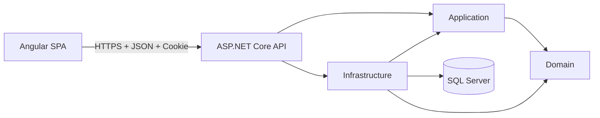
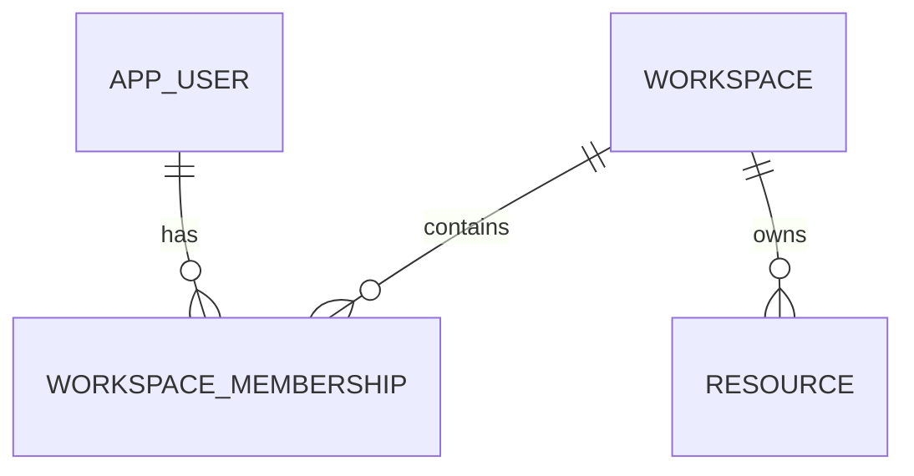

# PersonalOS - Architecture, Security, and Data

**Version:** 1.1
**Status:** Milestone 1 Angular walking skeleton

## 1. Drivers

- learn Angular without abandoning .NET;
- deliver personal value early;
- protect sensitive data;
- keep operating cost low;
- support automated testing;
- avoid overengineering;
- preserve a possible path toward SaaS;
- create an architecture that can be explained and defended during interviews.

## 2. Architectural style

PersonalOS is a modular monolith with a separate Angular single-page application.



The frontend and backend are separate projects, but they form one product and one security boundary. A same-origin deployment is preferred.

The system does not introduce microservices, multi-tenancy, billing, or a generic repository during the initial milestones.

## 3. Layers

### Domain

Contains:

- entities;
- value objects;
- invariants;
- pure business rules.

Domain does not know about EF Core, SQL Server, ASP.NET Core, Identity, Angular, TypeScript, or HTTP.

### Application

Contains:

- use cases;
- contracts;
- policies;
- internal DTOs;
- abstractions such as clock and current user;
- application-level authorization decisions when they are independent of transport.

Application depends only on Domain.

### Infrastructure

Contains:

- EF Core;
- SQL Server;
- ASP.NET Core Identity persistence;
- external services;
- background workers;
- storage implementations.

Infrastructure depends on Application and Domain.

### API

Contains:

- HTTP endpoints;
- authentication;
- authorization;
- antiforgery;
- Problem Details;
- rate limiting;
- OpenAPI;
- health checks;
- security headers;
- composition root.

API depends on Application and Infrastructure.

The API never exposes EF Core entities or Identity entities directly as public contracts.

### Angular

Contains:

- pages and feature components;
- templates;
- routing;
- authentication state;
- typed reactive forms;
- HTTP communication;
- loading, empty, success, and error states;
- accessibility behavior;
- application shell and responsive navigation.

Angular communicates only with the API. It never accesses SQL Server and never receives password hashes, security stamps, cookies, connection strings, or server secrets.

## 4. MVC to Angular mapping

| Familiar MVC concept | PersonalOS Angular equivalent |
|---|---|
| Razor View | Angular component template |
| Partial View | Reusable standalone component |
| `_Layout.cshtml` | Application shell with `router-outlet` |
| ViewModel | Explicit API DTO plus TypeScript interface or type |
| Controller returning View | API endpoint returning JSON |
| ModelState | Server validation plus typed reactive-form validation |
| Form POST | HttpClient command request |
| TempData | Navigation state or in-memory notification state |
| Session lookup | Authentication cookie plus `/api/auth/me` |
| Antiforgery form token | XSRF request token plus header |
| `RedirectToAction` | Angular Router navigation |
| EF entity rendered in a view | Purpose-built response DTO |
| Dependency injection | Angular `inject()` and ASP.NET Core DI |
| Action filter | API filter, middleware, or endpoint policy |
| Authorization attribute | Server authorization policy; guard only improves UX |

## 5. Angular concepts and boundaries

### Standalone components

The Angular application uses standalone components and does not introduce NgModules for new code.

A component should own:

- one clear user-facing responsibility;
- its template;
- its styles;
- local interaction state.

Large components must be split by responsibility rather than by arbitrary line count.

### Templates

Templates must:

- use semantic HTML;
- use Angular interpolation for text;
- avoid business logic;
- avoid unsafe HTML rendering;
- use the control-flow syntax supported by the installed Angular version;
- expose loading and error states clearly.

Backend-provided strings are treated as plain text.

### Signals

Signals are appropriate for:

- local UI state;
- authentication status;
- current user held in memory;
- derived view state.

Computed signals are used for derived values. Effects are reserved for synchronization with external systems and must not become a default replacement for explicit flow.

### RxJS

RxJS remains appropriate for:

- HttpClient requests;
- cancellation and composition of asynchronous operations;
- router events;
- streams that naturally produce multiple values.

The project does not convert every observable into a signal without a reason.

### Services and dependency injection

Services isolate responsibilities such as:

- authentication operations;
- current authentication state;
- Problem Details parsing;
- cross-cutting HTTP behavior.

Services must not become global bags of unrelated behavior.

### HttpClient

Angular uses `HttpClient` with strongly typed contracts.

Rules:

- use relative `/api` URLs;
- do not hard-code Development ports in TypeScript;
- do not create a generic wrapper that hides all HttpClient behavior;
- never retry login, registration, logout, or other non-idempotent requests blindly;
- expected `/api/auth/me` 401 responses represent anonymous state, not a global application error.

### Route guards

Functional guards:

- prevent unnecessary navigation;
- avoid showing protected pages to anonymous users;
- redirect authenticated users away from login and registration.

Guards are not security boundaries. The API must authorize every protected endpoint.

### HTTP interceptors

Functional interceptors are limited to cross-cutting concerns such as:

- consistent error normalization;
- correlation metadata when approved;
- authentication-loss handling;
- XSRF behavior when Angular's built-in support is not sufficient.

Feature-specific error messages remain inside their feature.

### Typed reactive forms

Login and registration use typed reactive forms.

Client validation improves user experience. Server validation remains authoritative.

Forms must:

- prevent duplicate submissions;
- preserve accessibility associations;
- never log values;
- use generic authentication errors;
- map safe validation errors to controls;
- keep unknown errors in a form-level summary.

### Server state

The current authenticated user is server state.

Startup flow:

```text
Angular starts
-> authentication state is unknown/loading
-> GET /api/auth/me
-> 200: authenticated in-memory state
-> 401: anonymous state
```

The application does not persist the current user or an authentication token in browser storage.

## 6. Data

Conventions:

- `Guid` for keys;
- `UserId` for initial ownership;
- `DateTimeOffset` in UTC for instants;
- `DateOnly` for a local calendar day;
- IANA time-zone identifiers;
- unique constraints for invariants;
- indexes based on real query patterns;
- versioned historical goals;
- explicit concurrency decisions for mutable data.

Do not use `DateTime.Now` directly in business rules that must be tested.

Client-provided identifiers never prove ownership. Protected queries derive the authenticated user from the server principal and scope data by that user.

## 7. Identity and authentication

Initial identity model:

- `AppUser : IdentityUser<Guid>`;
- `IdentityRole<Guid>`;
- `DisplayName`;
- `CreatedAtUtc`;
- unique email behavior;
- lockout;
- security stamp;
- authentication cookie named `PersonalOS.Auth`;
- `HttpOnly`;
- intentional `SameSite` policy;
- `Secure` outside Development;
- API returns 401 or 403 instead of HTML redirects.

Endpoints:

```text
POST /api/auth/register
POST /api/auth/login
POST /api/auth/logout
GET  /api/auth/me
GET  /api/antiforgery/token
```

Milestone 1 does not implement:

- email confirmation;
- account recovery;
- MFA;
- passkeys;
- external login.

The server authentication cookie is never exposed to Angular. Angular does not create, parse, mirror, or store a JWT.

## 8. Antiforgery and CSRF

Cookie authentication creates CSRF risk because the browser may send cookies automatically.

Preferred same-origin flow:

```text
Angular requests /api/antiforgery/token
-> API creates its internal antiforgery cookie
-> API exposes only the request token through the agreed XSRF mechanism
-> Angular sends X-XSRF-TOKEN on POST, PUT, PATCH, and DELETE
-> API validates the token pair
```

Recommended compatibility names:

```text
Readable request-token cookie: XSRF-TOKEN
Request header: X-XSRF-TOKEN
```

The readable XSRF cookie is not the authentication cookie and contains no identity or session data.

Rules:

- GET, HEAD, and OPTIONS do not require antiforgery validation;
- authentication-changing and data-changing requests do require it;
- the request token is never stored in `localStorage` or `sessionStorage`;
- missing or invalid tokens return sanitized Problem Details;
- integration tests prove rejection without the token and success with it;
- antiforgery must not be disabled on login or registration merely for convenience.

## 9. CORS and origin strategy

A same-origin architecture is preferred:

- Angular uses relative `/api` and `/health` URLs;
- the Angular Development proxy forwards to the HTTPS API;
- production serves the SPA and API from one trusted site when practical.

When same-origin proxying is used, unnecessary CORS is not enabled.

If CORS becomes genuinely necessary:

- allow explicit known origins only;
- allow credentials only with explicit origins;
- never combine credentials with any-origin behavior;
- restrict methods and headers;
- configure production origins outside source code;
- fail closed when the configuration is missing.

CORS does not replace antiforgery.

## 10. Security model

### Data classification

| Data | Classification |
|---|---|
| profile | Personal |
| tasks and habits | Sensitive |
| nutrition | Sensitive |
| journal | Highly sensitive |
| authentication cookie and secrets | Critical |
| future vault | Extreme criticality |

### Main threats

- session theft;
- CSRF;
- XSS;
- brute force;
- account enumeration;
- cross-user access;
- secret leakage;
- sensitive logs;
- vulnerable npm or NuGet dependency;
- exposed backup;
- sensitive notification content;
- duplicate jobs;
- incorrect time-zone handling;
- private browser caching;
- source-map or bundle leakage;
- permissive CORS;
- trusting frontend route protection.

### Main controls

- HTTPS;
- HttpOnly authentication cookie;
- Secure production cookie;
- antiforgery;
- Identity lockout;
- rate limiting;
- server-side authorization;
- server-side ownership filters;
- parameterized EF Core queries;
- external secrets;
- package auditing;
- safe logs;
- negative security tests;
- explicit browser-state rules;
- no-store responses where appropriate;
- security-header review;
- backup and restore controls before production.

## 11. XSS and browser security

Angular interpolation and template binding are the default output mechanisms.

Prohibited without an explicit security review:

- rendering user or API data through `[innerHTML]`;
- direct DOM injection;
- `document.write`;
- `eval`;
- `new Function`;
- dynamic template compilation;
- `bypassSecurityTrustHtml`;
- `bypassSecurityTrustScript`;
- `bypassSecurityTrustUrl`;
- rendering Problem Details as HTML;
- concatenating untrusted values into executable URLs.

Security headers should include, where compatible with the hosting model:

- `X-Content-Type-Options`;
- `Referrer-Policy`;
- frame-embedding protection;
- an intentionally restricted `Permissions-Policy`.

A production Content Security Policy and Trusted Types evaluation belong to hardening. They must be validated against the actual Angular build and hosting model. Broad `unsafe-*` directives must not be added merely to silence browser errors.

CSP supplements safe Angular coding; it does not replace it.

## 12. Browser state and caching

The frontend may hold current-user state in memory.

The frontend must not persist:

- authentication tokens;
- authentication cookies;
- antiforgery tokens;
- current-user objects;
- private API responses;
- journal content;
- nutrition or habit history.

Additional rules:

- do not place personal data in query strings;
- do not expose server secrets through Angular environment files;
- remember that environment values are public after compilation;
- clear private in-memory state after logout and authentication loss;
- do not cache authenticated API responses in a service worker;
- use `Cache-Control: no-store` for authentication and antiforgery responses where appropriate;
- inspect production output for localhost URLs and accidental secrets.

Non-sensitive visual preferences may be considered later, but are not part of Milestone 1.

## 13. Authorization

Every protected API endpoint enforces authorization on the server.

For user-owned resources:

- derive the user identifier from the authenticated principal;
- never accept a client `UserId` as proof of ownership;
- scope database queries by the authenticated user;
- use 404 instead of revealing another user's resource when appropriate;
- test anonymous, forbidden, and cross-user access;
- never depend on an Angular guard to protect data.

## 14. Error contracts

API errors use `application/problem+json`.

Responses must not expose:

- stack traces;
- SQL;
- internal type names;
- file paths;
- connection details;
- secrets;
- password-policy internals that enable enumeration;
- sensitive request bodies.

Angular models Problem Details explicitly and safely handles responses that are not valid Problem Details.

Important categories:

- validation;
- unauthorized;
- forbidden;
- conflict;
- rate limit;
- server error.

Expected `/api/auth/me` 401 responses are converted to anonymous state without a generic error notification.

## 15. Logging

Allowed:

- timestamp;
- route template;
- status;
- duration;
- event identifier;
- trace identifier;
- user identifier only when necessary and proportionate.

Forbidden:

- password;
- cookie;
- token;
- antiforgery token;
- authorization header;
- connection string;
- journal content;
- complete authentication request body;
- unnecessary personal data.

Logs must use structured events and safe message templates.

## 16. Persistence

- `ApplicationDbContext`;
- migrations live in Infrastructure;
- no `EnsureCreated` in normal application startup;
- no automatic production migrations;
- review generated SQL;
- test a clean database;
- test supported upgrades;
- create a backup before destructive changes.

A generic repository is not used because EF Core already provides unit-of-work and repository-like behavior, and feature-specific queries are clearer.

Integration tests may use SQLite for fast HTTP behavior, but they do not prove that SQL Server migrations are valid.

## 17. Dependency security

Before adding a package:

1. confirm Angular, .NET, or the browser does not already provide the capability;
2. verify compatibility with the pinned framework version;
3. justify the package;
4. update the lockfile;
5. run the dependency audit.

Rules:

- do not run forced audit fixes;
- do not add preview packages by default;
- do not perform unrelated major upgrades;
- zero known High or Critical vulnerabilities is the delivery target;
- any temporary exception records package, dependency path, affected code path, mitigation, and planned fix.

## 18. Future SaaS evolution

Initial situation:

```text
AppUser -> resources through UserId
```

Possible evolution:



Introduce this only when there are external users, collaboration, roles, sharing, willingness to pay, and sufficient operational capacity.

Before SaaS, decide:

- isolation;
- authorization;
- migration;
- invitations;
- roles;
- billing;
- auditing;
- caching;
- storage;
- backups;
- tenant-aware jobs.

> Designing so SaaS remains possible does not mean building SaaS before there are customers.

## 19. Accepted decisions

1. Modular monolith.
2. Angular SPA plus ASP.NET Core API.
3. ASP.NET Core Identity with same-origin cookies.
4. Antiforgery on state-changing requests.
5. SQL Server plus EF Core.
6. `UserId` as initial ownership.
7. No premature multi-tenancy.
8. No microservices.
9. No generic repository.
10. No JWT in `localStorage` or `sessionStorage`.
11. No permissive CORS.
12. Authentication state is loaded from `/api/auth/me`.
13. Frontend guards never replace server authorization.
14. English-only repository content.
15. Minimal, living documentation.
