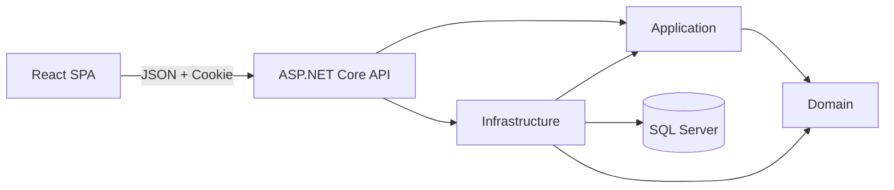
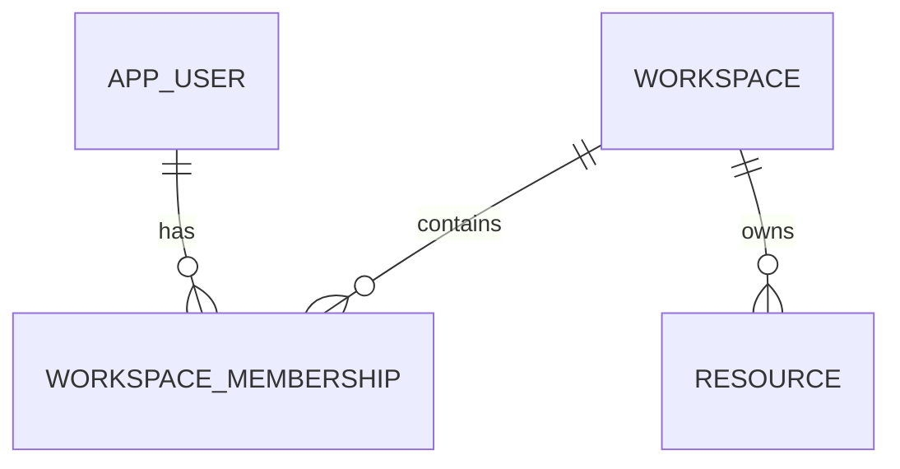

# PersonalOS — Arquitectura, seguridad y datos

**Versión:** 1.0  
**Estado:** Baseline

## 1. Drivers

- aprender React sin abandonar .NET;
- entregar valor personal temprano;
- proteger datos sensibles;
- mantener bajo costo;
- permitir pruebas;
- evitar sobrearquitectura;
- conservar una ruta posible hacia SaaS.

## 2. Estilo arquitectónico

Monolito modular con frontend React separado.



## 3. Capas

### Domain

Contiene:

- entidades;
- value objects;
- invariantes;
- reglas puras.

No conoce EF Core, SQL Server, ASP.NET Core, Identity, React o HTTP.

### Application

Contiene:

- casos de uso;
- contratos;
- políticas;
- DTO internos;
- abstracciones como reloj y usuario actual.

Depende solo de Domain.

### Infrastructure

Contiene:

- EF Core;
- SQL Server;
- Identity;
- servicios externos;
- workers;
- almacenamiento.

Depende de Application y Domain.

### API

Contiene:

- endpoints;
- autenticación;
- autorización;
- antiforgery;
- ProblemDetails;
- rate limiting;
- OpenAPI;
- health;
- composition root.

### React

Contiene:

- páginas;
- componentes;
- routing;
- server state;
- formularios;
- estados visuales.

No accede directamente a SQL Server.

## 4. MVC → React

| MVC conocido | PersonalOS |
|---|---|
| Razor View | React Component |
| Partial View | componente reutilizable |
| `_Layout.cshtml` | App Shell/Layout |
| ViewModel | DTO C# + type TypeScript |
| Controller con View | API con JSON |
| ModelState | validación server + Zod |
| Form POST | mutation con fetch |
| TempData | query invalidation/toast |
| Session | cookie + `/api/auth/me` |
| antiforgery form | token + header |
| RedirectToAction | navegación cliente |
| EF entity en vista | DTO |

Conceptos React:

- props: entradas explícitas;
- estado local: interacción del componente;
- server state: datos remotos con TanStack Query;
- render: debe ser puro;
- effect: sincronización con sistemas externos;
- mutation: POST/PUT/PATCH/DELETE;
- route guard: mejora UX, no reemplaza autorización.

## 5. Datos

Convenciones:

- `Guid` para claves;
- `UserId` para ownership inicial;
- `DateTimeOffset` UTC para instantes;
- `DateOnly` para día local;
- zona horaria IANA;
- restricciones únicas para invariantes;
- índices según consultas reales;
- objetivos históricos versionados.

No usar `DateTime.Now` directamente en reglas que deban probarse.

## 6. Identity

Primera versión:

- `AppUser : IdentityUser<Guid>`;
- `IdentityRole<Guid>`;
- `DisplayName`;
- `CreatedAtUtc`;
- email único;
- lockout;
- security stamp;
- cookie `PersonalOS.Auth`;
- `HttpOnly`;
- `SameSite=Lax`;
- `Secure` en producción;
- 401/403 para API;
- no redirect HTML.

Endpoints:

```text
POST /api/auth/register
POST /api/auth/login
POST /api/auth/logout
GET  /api/auth/me
GET  /api/antiforgery/token
```

No implementar todavía:

- confirmación de correo;
- recuperación;
- MFA;
- passkeys;
- external login.

## 7. Antiforgery

Con cookies existe riesgo CSRF.

Flujo:

```text
React solicita token
-> API crea cookie antiforgery
-> React recibe request token
-> POST/PUT/PATCH/DELETE envían X-XSRF-TOKEN
-> API valida
```

No usar CORS permisivo.

## 8. Seguridad

Clasificación:

| Dato | Nivel |
|---|---|
| perfil | Personal |
| tareas/hábitos | Sensible |
| nutrición | Sensible |
| diario | Altamente sensible |
| cookie/secretos | Crítico |
| vault futuro | Crítico extremo |

Amenazas principales:

- robo de sesión;
- CSRF;
- XSS;
- brute force;
- enumeración;
- acceso cruzado;
- secret leakage;
- logs sensibles;
- dependencia vulnerable;
- backup expuesto;
- notificación sensible;
- duplicación de jobs;
- tiempo incorrecto.

Controles:

- HTTPS;
- HttpOnly;
- antiforgery;
- lockout;
- rate limit;
- ownership server-side;
- EF parametrizado;
- secretos externos;
- auditoría de paquetes;
- logs seguros;
- pruebas negativas.

## 9. Logging

Permitido:

- timestamp;
- route;
- status;
- duration;
- event id;
- trace id;
- user id cuando sea necesario.

Prohibido:

- password;
- cookie;
- token;
- antiforgery;
- authorization header;
- connection string;
- diario;
- datos personales innecesarios.

## 10. Persistencia

- `ApplicationDbContext`;
- migraciones en Infrastructure;
- no `EnsureCreated`;
- no migraciones automáticas en producción;
- revisar SQL generado;
- probar base vacía;
- probar upgrade;
- backup antes de cambios destructivos.

No usar repositorio genérico.

## 11. SaaS futuro

Situación inicial:

```text
AppUser -> recursos mediante UserId
```

Evolución posible:



Solo introducir cuando existan usuarios externos, colaboración, roles, sharing, voluntad de pago y capacidad operativa.

Antes de SaaS se debe decidir:

- aislamiento;
- autorización;
- migración;
- invitaciones;
- roles;
- billing;
- auditoría;
- cache;
- storage;
- backups;
- jobs tenant-aware.

> Diseñar para no bloquear SaaS no significa construir SaaS antes de tener clientes.

## 12. Decisiones aceptadas

1. Monolito modular.
2. React SPA + ASP.NET Core API.
3. Identity + cookies same-origin.
4. SQL Server + EF Core.
5. UserId como ownership inicial.
6. No multi-tenancy prematuro.
7. No microservicios.
8. No repositorio genérico.
9. No JWT en localStorage.
10. Documentación mínima y viva.
