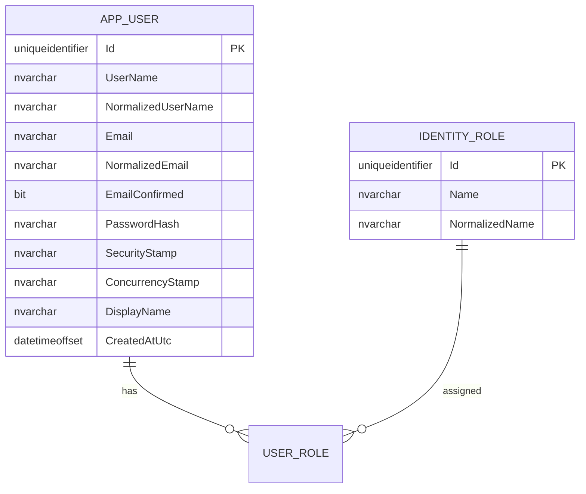
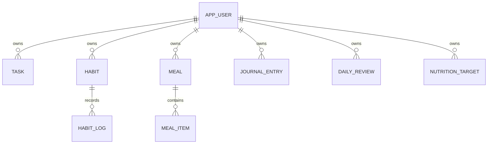

# PersonalOS — Backend Schema

**Versión:** 1.0  
**Estado:** Proposed  
**Última actualización:** 2026-07-23

## 1. Objetivo

Definir estructura backend, contratos, datos y persistencia. No sustituye migraciones; las explica.

## 2. Proyectos

```text
PersonalOS.Domain
PersonalOS.Application
PersonalOS.Infrastructure
PersonalOS.Api
```

## 3. Organización por feature

```text
PersonalOS.Application/
└── Habits/
    ├── CreateHabit/
    ├── RecordHabit/
    └── GetTodayHabits/

PersonalOS.Api/
└── Features/Habits/
```

Evitar carpetas globales gigantes de `Services`, `Managers`, `Helpers` o `Dtos`.

## 4. Composition root

`Program.cs`:

- crea builder;
- registra capas;
- configura middleware;
- mapea endpoints;
- ejecuta host.

No esconder dependencias con service locator.

## 5. EF Core

```text
Infrastructure/
└── Persistence/
    ├── ApplicationDbContext.cs
    ├── Configurations/
    ├── Interceptors/
    └── Migrations/
```

Herencia inicial:

```csharp
IdentityDbContext<AppUser, IdentityRole<Guid>, Guid>
```

## 6. Identity



## 7. Dominio futuro — borrador



No autoriza crear todas las tablas en M1.

## 8. Convenciones

- `Id: Guid`;
- `UserId: Guid`;
- `CreatedAtUtc: DateTimeOffset`;
- `DateOnly` para día local;
- concurrencia optimista cuando sea necesaria;
- unique constraints para invariantes;
- índices por consultas reales.

## 9. HTTP inicial

```text
POST /api/auth/register
POST /api/auth/login
POST /api/auth/logout
GET  /api/auth/me
GET  /api/antiforgery/token
```

`/me` solo devuelve:

- id;
- displayName;
- email.

## 10. Errores

`application/problem+json`:

- type;
- title;
- status;
- detail seguro;
- instance;
- traceId;
- errors.

Sin stack trace en producción.

## 11. Status codes

- 200 consulta;
- 201 creación;
- 204 sin cuerpo;
- 400 formato;
- 401 no autenticado;
- 403 no autorizado;
- 404 no visible;
- 409 conflicto;
- 422 negocio;
- 429 limit;
- 500 inesperado.

## 12. Ownership

1. obtener `UserId` del principal;
2. filtrar server-side;
3. no aceptar ownership del request;
4. 404 cuando evite revelar;
5. probar acceso cruzado.

## 13. Migraciones

- assembly en Infrastructure;
- nombre descriptivo;
- revisar SQL;
- no `EnsureCreated`;
- no auto-migrate producción;
- backup;
- base vacía;
- upgrade;
- backfill idempotente.

## 14. Transacciones

Explícitas solo si varias escrituras deben ser atómicas. `SaveChanges` cubre una unidad simple.

## 15. Repositorios

No repositorio genérico.

Permitido:

- DbContext en Infrastructure;
- interfaces específicas;
- query services;
- servicios de dominio.

## 16. Idempotencia

- recordatorios;
- importaciones;
- callbacks;
- reintentos;
- registros diarios;
- offline.

## 17. Consultas

- proyección DTO;
- `AsNoTracking`;
- paginación;
- no Include masivo;
- no N+1;
- medir antes de cache;
- no entidades EF en API.

## 18. Auditoría

Registrar de forma segura:

- cuenta;
- login success/failure;
- lockout;
- logout;
- cambios de seguridad.

Nunca password, cookie o token.
