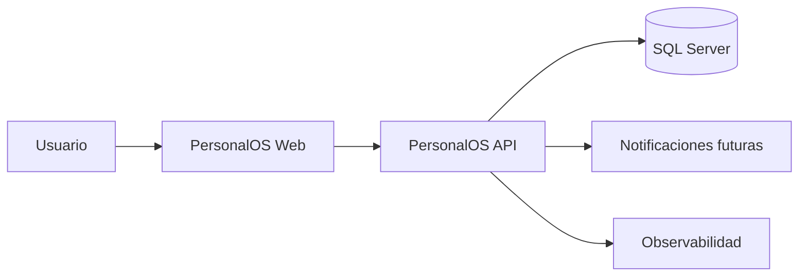
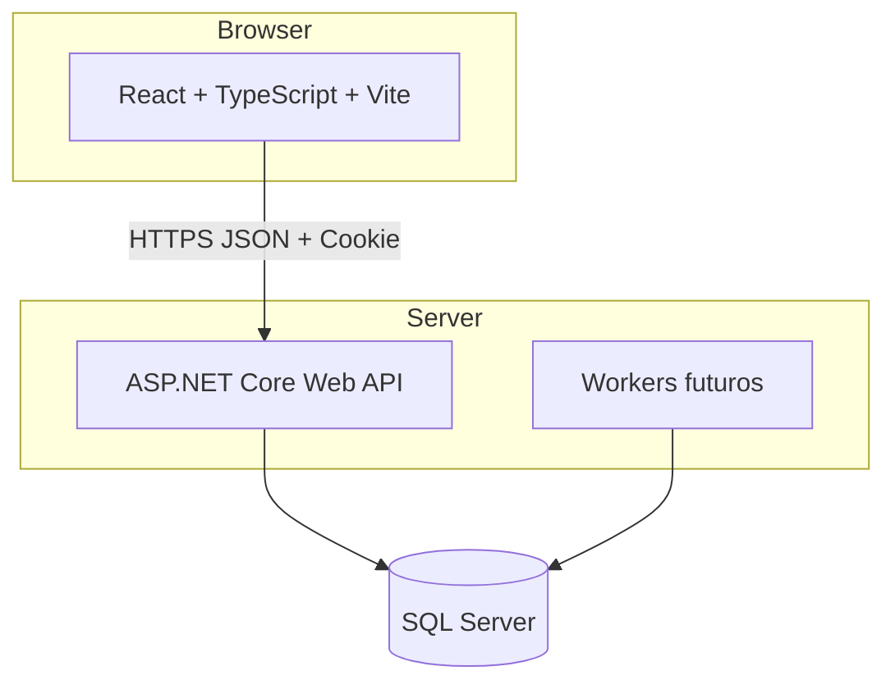
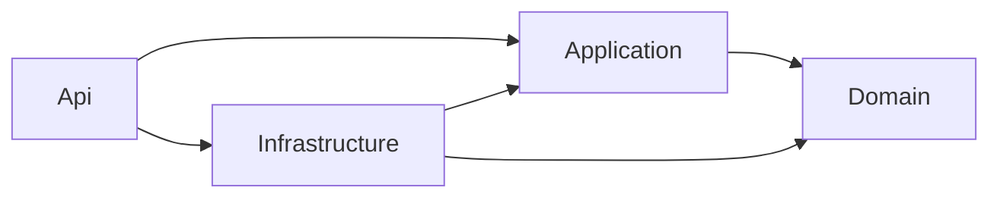
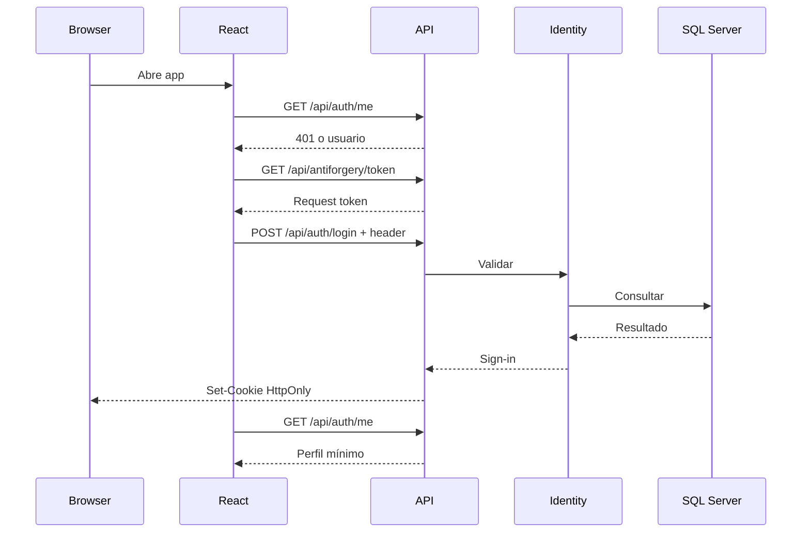
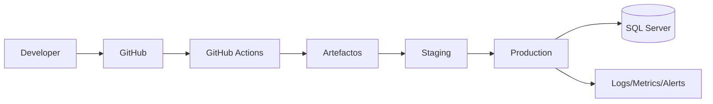

# PersonalOS — Arquitectura del sistema

**Versión:** 1.0  
**Estado:** Proposed  
**Última actualización:** 2026-07-23

## 1. Drivers

- aprender React conservando .NET;
- entregar valor personal temprano;
- proteger datos sensibles;
- permitir pruebas aisladas e integración;
- mantener bajo costo;
- evolucionar sin asumir SaaS;
- generar evidencia profesional.

## 2. Estilo

Monolito modular con frontend SPA separado.

La separación en proyectos crea límites de compilación. La organización por features crea límites funcionales.

## 3. Contexto



## 4. Contenedores



## 5. Componentes backend



### Domain

- entidades;
- value objects;
- invariantes;
- eventos solo con necesidad.

### Application

- casos de uso;
- interfaces;
- políticas;
- DTO internos.

### Infrastructure

- EF Core;
- Identity;
- SQL Server;
- servicios;
- workers;
- almacenamiento.

### API

- HTTP;
- auth;
- antiforgery;
- ProblemDetails;
- rate limiting;
- DI;
- health.

## 6. Módulos futuros

```text
Identity
Planning
Habits
Nutrition
Journal
Reviews
Insights
Notifications
Exports
```

Cada módulo debe tener ownership, contrato, reglas, casos de uso, pruebas y docs.

No crear un proyecto por módulo hasta que el tamaño lo justifique.

## 7. Frontend

```text
src/
├── app/
├── components/
├── features/
├── lib/
├── pages/
└── styles/
```

Reglas:

- remoto en TanStack Query;
- formularios en React Hook Form;
- validación Zod;
- estado local cerca;
- no store global por defecto;
- HTTP centralizado;
- features no importan internals ajenos.

## 8. Sesión



## 9. Datos

- Identity administra identidad.
- Recursos futuros contienen `UserId`.
- Filtro de ownership en servidor.
- Frontend nunca autoriza.
- DB refuerza invariantes.
- objetivos temporales versionados.

## 10. Despliegue



M1 implementa CI. Staging/production después.

## 11. Evolución SaaS

Solo con evidencia:

```text
AppUser
  └── WorkspaceMembership
          └── Workspace
```

Requiere usuarios reales, sharing, roles, aislamiento, threat model, ADR y migración probada.

## 12. Simplicidad

Toda tecnología nueva requiere:

- problema;
- alternativas;
- costo;
- riesgo;
- reversibilidad;
- ADR cuando sea relevante.

## 13. Revisiones

- fin de milestone;
- antes de auth pública;
- antes de recordatorios;
- antes de datos sensibles;
- antes de IA;
- antes de SaaS;
- antes de producción.
