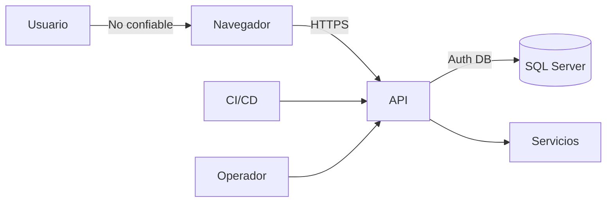

# PersonalOS — Threat Model

**Versión:** 1.0  
**Estado:** Proposed  
**Última actualización:** 2026-07-23

## 1. Alcance

Incluye navegador, React, API, Identity, SQL Server, CI, configuración, logs, backups y notificaciones futuras.

El vault queda fuera y requerirá un modelo independiente.

## 2. Activos

| Activo | Clasificación |
|---|---|
| código público futuro | Público |
| config no secreta | Interno |
| correo/perfil | Personal |
| tareas/hábitos | Sensible |
| nutrición/peso | Sensible |
| diario | Altamente sensible |
| cookie de sesión | Crítico |
| secretos/claves | Crítico |
| vault futuro | Crítico extremo |
| backups | máxima heredada |

## 3. Actores

- usuario legítimo;
- atacante remoto;
- atacante con dispositivo;
- dependency comprometida;
- operador;
- agente IA;
- servicio externo.

## 4. Trust boundaries

## 5. Amenazas

| Amenaza | Escenario | Control |
|---|---|---|
| session theft | cookie/dispositivo | HTTPS, HttpOnly, Secure, logout |
| CSRF | POST externo | antiforgery, SameSite |
| XSS | script | escaping, CSP futura, no dangerous HTML |
| enumeration | mensajes | error genérico, rate limit |
| brute force | login | lockout, rate limit |
| IDOR | cambiar id | ownership server-side |
| SQL injection | input | EF params, validation |
| secret leakage | Git/log/prompt | secrets/env/scanning |
| sensitive logging | diario/password | logging policy |
| dependency attack | package | locks, audit |
| backup exposure | copy | encryption/access/restore |
| notification exposure | preview | contenido mínimo |
| prompt leakage | IA | redacción/acuerdo |
| duplicate jobs | retry | idempotency |
| time confusion | día incorrecto | UTC + local date + zone |
| destructive migration | pérdida | backup/review/rehearsal |

## 6. Identity controls

M1:

- Identity;
- password policy;
- lockout;
- security stamp;
- cookie;
- 401/403;
- antiforgery;
- rate limit.

Antes de público:

- email confirmation;
- recovery;
- MFA/passkeys;
- session management;
- headers;
- CSP;
- audit;
- abuse monitoring.

## 7. Datos sensibles

### Diario

- no body en logs;
- no preview completo;
- no analytics externo;
- export protegido;
- eliminación definida;
- considerar cifrado.

### Nutrición

- no compartir;
- no diagnosticar;
- no premiar consumo peligroso;
- corrección histórica controlada.

## 8. Authorization

Toda query futura incluye `UserId` del principal.

Nunca:

- aceptar UserId del cliente como autoridad;
- filtrar solo en React;
- confiar en GUID;
- revelar datos cruzados en errores.

## 9. Logs

Permitido:

- evento;
- timestamp;
- user id pseudónimo si se necesita;
- route;
- status;
- duration;
- trace id.

Prohibido:

- password;
- cookie;
- token;
- auth header;
- antiforgery;
- journal body;
- connection string.

## 10. IA

- no secretos;
- no datos productivos completos;
- anonimizar;
- revisar diff;
- no confiar criptografía;
- no delegar authorization;
- registrar decisiones, no datos.

## 11. Gates

Cada PR:

- threat check;
- input;
- authorization;
- logs;
- secrets;
- audit;
- negative tests.

Antes de producción:

- security review;
- headers;
- TLS;
- recovery;
- backup;
- restore;
- incident response;
- scan;
- DAST básico;
- access review.

## 12. Riesgo aceptado inicial

M1 no incluye confirmation, recovery ni MFA. Solo desarrollo/staging controlado hasta hardening.
