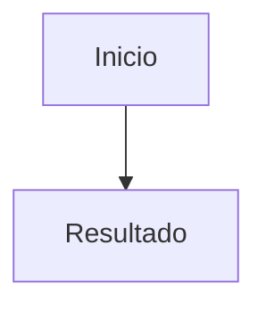

# Feature — Nombre

- **ID:**
- **Estado:** Draft
- **Owner:**
- **Milestone:**
- **Última actualización:**

## Problema

## Usuario y resultado

## Alcance

## No alcance

## Reglas e invariantes

## App Flow

## Datos

### Entidades

### Índices/restricciones

### Migración

## API

### Requests

### Responses

### Errores

## UI

- loading;
- empty;
- success;
- validation;
- forbidden;
- conflict;
- offline.

## Seguridad

- auth;
- authorization;
- ownership;
- CSRF;
- XSS;
- rate limit;
- logging;
- classification.

## Observabilidad

## Pruebas

### Unit

### Integration

### Frontend

### E2E

### Manual

## Criterios

- [ ]

## Riesgos

## ADRs

## Evidencia
