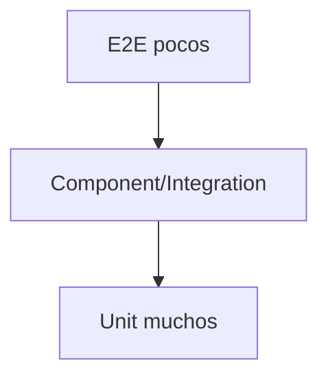

# PersonalOS — Estrategia de pruebas

**Versión:** 1.0  
**Estado:** Proposed  
**Última actualización:** 2026-07-23

## Objetivo

Evidencia proporcional al riesgo. No perseguir cobertura aislada.

## Capas

### Unit

- invariantes;
- cálculos;
- tiempo;
- validadores puros;
- políticas.

Rápidas, deterministas, sin red/DB.

### Integration

- API;
- middleware;
- Identity;
- EF Core;
- serialización;
- antiforgery;
- authorization;
- ProblemDetails.

### Component

- formularios;
- estados;
- routing;
- accesibilidad;
- query client;
- mocks de red.

### E2E

- register;
- login;
- crear tarea;
- hábito;
- cierre;
- logout.

### Operational

- health;
- migrations;
- backup/restore;
- smoke;
- alerts;
- performance.

## Pirámide

## M1 backend

1. register válido;
2. duplicado;
3. login válido;
4. login inválido;
5. lockout;
6. me 401;
7. me user;
8. logout;
9. antiforgery inválido;
10. antiforgery válido;
11. live;
12. ready.

## M1 frontend

1. validación register;
2. validación login;
3. route loading;
4. redirect;
5. dashboard;
6. ProblemDetails;
7. logout.

## Base de datos

- SQLite in-memory puede acelerar M1;
- no sustituye SQL Server;
- migrations en SQL Server real;
- base vacía;
- upgrade;
- índices;
- constraints;
- SQL revisado;
- backfill.

## Tiempo

- cambio de día;
- medianoche;
- zona;
- DST;
- semana;
- target versionado;
- reminder atrasado;
- retry;
- clock skew.

Usar reloj inyectable.

## Seguridad

- sin auth;
- acceso cruzado;
- CSRF;
- rate limit;
- lockout;
- inputs maliciosos;
- logs;
- export;
- headers;
- sesión invalidada.

## Accesibilidad

- labels;
- focus;
- keyboard;
- roles;
- contrast review;
- live regions;
- axe futuro.

## Datos de prueba

- builders;
- factories;
- users únicos;
- order independent;
- cleanup;
- no datos reales;
- culture/zone explícita.

## Flaky tests

Es defecto:

1. reproducir;
2. corregir;
3. cuarentena solo temporal y documentada;
4. owner;
5. deadline.

## Quality gates

- cero failures;
- cero warnings propios;
- cero High/Critical;
- tests para reglas;
- negative authorization;
- migration validada;
- build frontend;
- lint.

## Coverage

Prioridad:

1. seguridad/datos;
2. invariantes;
3. tiempo;
4. errores;
5. happy path;
6. visual.

## Evidencia PR

- comandos;
- cantidad;
- casos;
- riesgos no cubiertos;
- manual;
- screenshots/video;
- migration impact.
