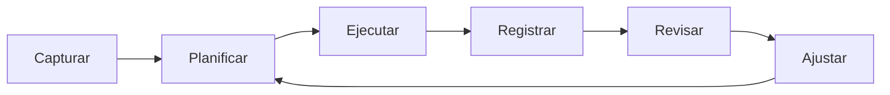
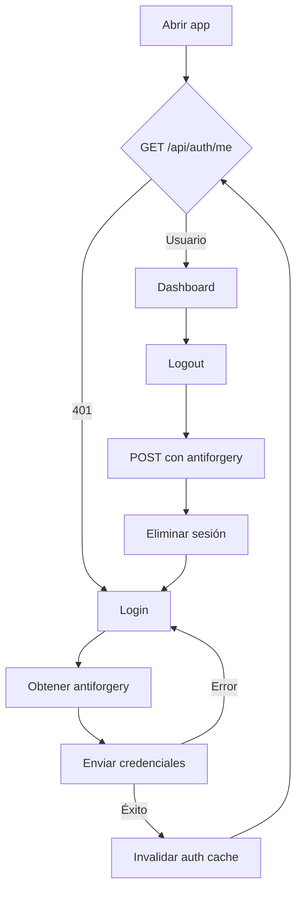
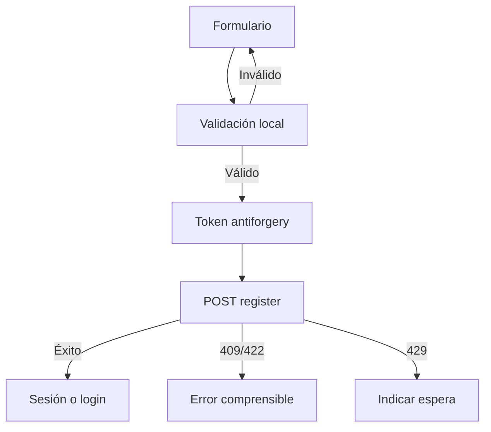
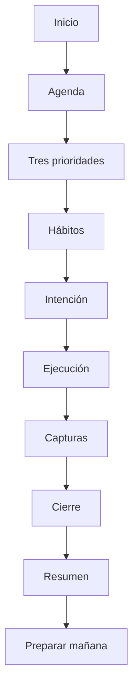
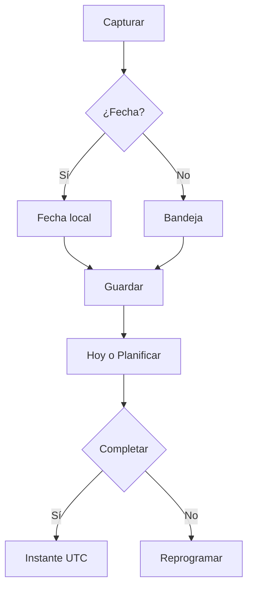
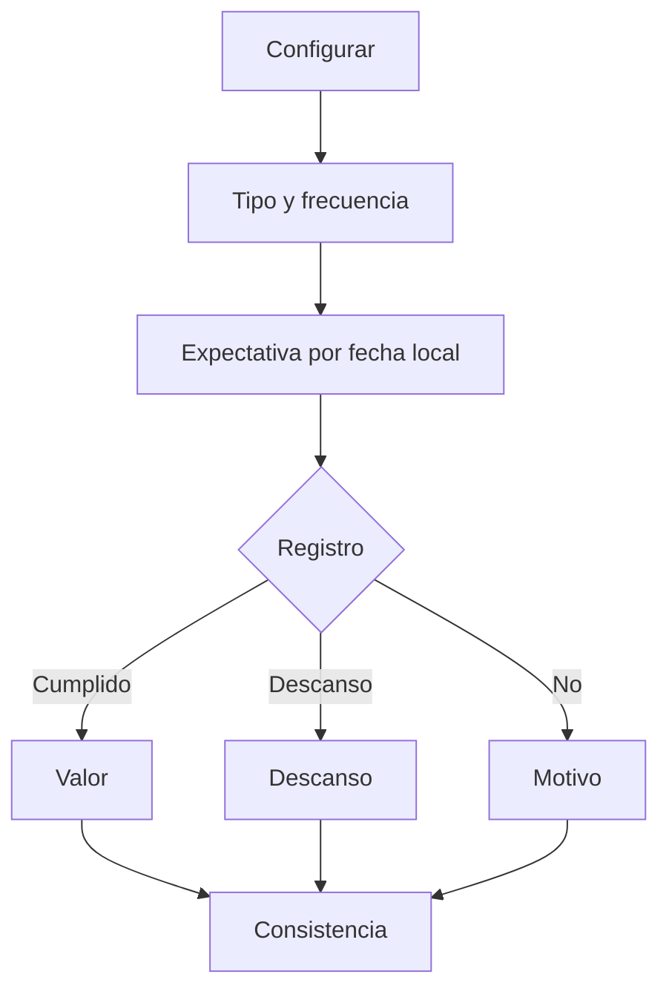
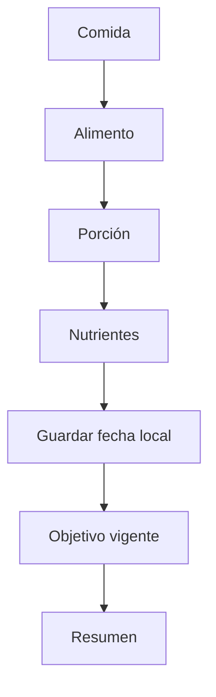
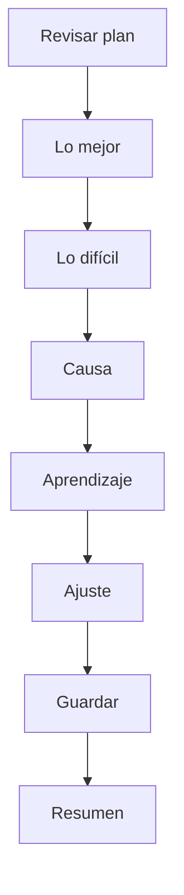
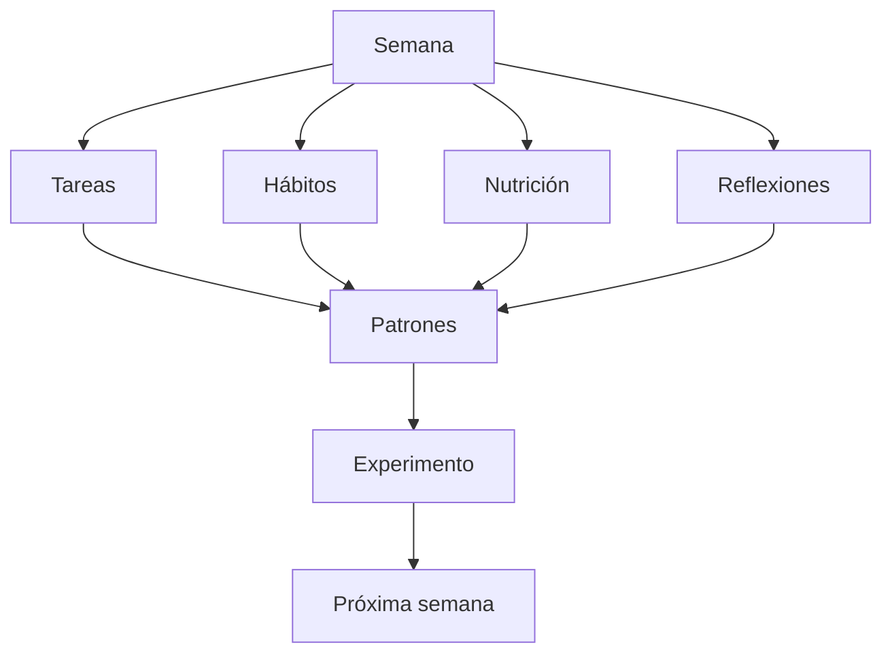
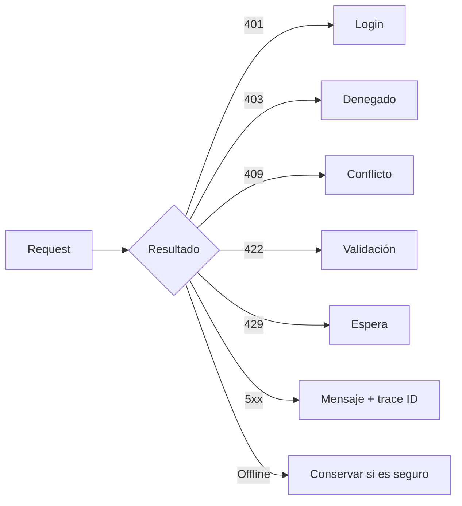

# PersonalOS — App Flow

**Versión:** 1.0  
**Estado:** Proposed  
**Última actualización:** 2026-07-23

## Ciclo general

## Autenticación

## Registro

## Ciclo diario futuro

## Tarea futura

## Hábito futuro

## Nutrición futura

## Cierre futuro

## Revisión semanal

## Errores

## Regla

Cada feature debe documentar entrada, decisiones, errores, salida, datos y autorización antes de implementación.
